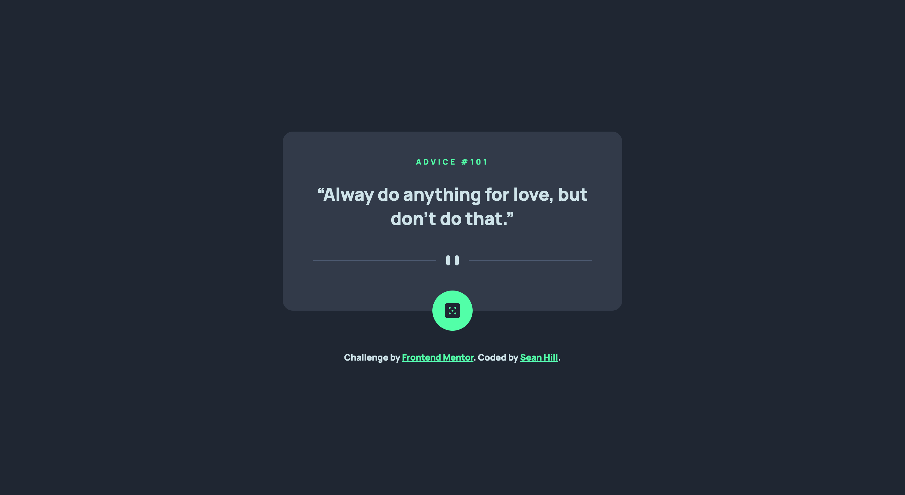

# Frontend Mentor - Advice generator app solution

This is a solution to the [Advice generator app challenge on Frontend Mentor](https://www.frontendmentor.io/challenges/advice-generator-app-QdUG-13db). Frontend Mentor challenges help you improve your coding skills by building realistic projects.

## Table of contents

- [Overview](#overview)
  - [The challenge](#the-challenge)
  - [Screenshot](#screenshot)
  - [Links](#links)
- [My process](#my-process)
  - [Built with](#built-with)
  - [What I learned](#what-i-learned)
  - [Continued development](#continued-development)
  - [Useful resources](#useful-resources)
- [Author](#author)

## Overview

### The challenge

Users should be able to:

- View the optimal layout for the app depending on their device's screen size
- See hover states for all interactive elements on the page
- Generate a new piece of advice by clicking the dice icon

### Screenshot



### Links

- Solution URL: [View on Netlify](https://fem-advice-generator-app-seanhillweb.netlify.app/)
- Project URL: [View on Github](https://github.com/seanhillweb/frontend-mentor-advice-generator-app)

## My process

### Built with

- [React](https://reactjs.org/)
- [Next.js](https://nextjs.org/)
- [Tailwind CSS](https://tailwindcss.com/)
- [Axios](https://axios-http.com/)

### What I learned

A small setup for handling data and load proved to be pretty effective for this application. I'm glad I was able to condense the logic into a relative simple implementation.

```js
const [loading, setLoading] = useState(true);
const [isAdvice, setAdvice] = useState({});

const generateAdvice = async () => {
  let id = Math.floor(Math.random() * 224);

  try {
    const response = await axios.get(`https://api.adviceslip.com/advice/${id}`);
    setAdvice(response.data.slip);
  } catch (error) {
    console.error(error);
  }

  setLoading(false);
};

useEffect(() => {
  generateAdvice();
}, []);

const handleOnClick = () => {
  generateAdvice();
};
```

### Continued development

I'm interested in finding a deeper challenge. This seemed like a straightforward implementation of Axios and a API request.

### Useful resources

- [Fetching data with React hooks and Axios](https://dev.to/darkmavis1980/fetching-data-with-react-hooks-and-axios-114h) - This article helped with the initial scaffolding for the application data.

## Author

- Website - [Sean Hill](https://www.seanhillweb.com)
- Frontend Mentor - [@seanhillweb](https://www.frontendmentor.io/profile/seanhillweb)
- Github - [@seanhillweb](https://github.com/seanhillweb)
